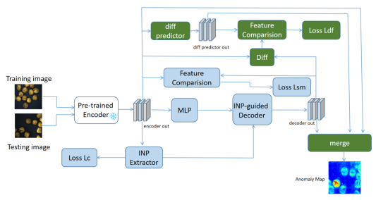

# VAND2025 Challenge - Track 1 

## Overview

This repository contains a template for the code submission for Track 1 
(MVTec AD 2 Dataset) of the VAND2025 Challenge @ CVPR 2025.

**Challenge Website:** 
[https://sites.google.com/view/vand30cvpr2025/challenge](https://sites.google.com/view/vand30cvpr2025/challenge)

**CRITICAL:**
The reproducibility of your results is paramount. Please specify a project link 
to a github repo when submitting to the MVTec Benchmark Server
([https://benchmark.mvtec.com/](https://benchmark.mvtec.com/)).


## Introduction
This repository contains the implementation of Filter-Former, a robust anomaly detection model based on the Augmented INP-Former. It aims to improve the accuracy and robustness of visual anomaly detection in industrial inspection and medical screening scenarios.
The architecture of o Filter-Former method is illustrated in Figure 2. The blue modules represent the original structure of INP-Former, while the green modules highlight our improvements.
<p align="center">
  
</p>
## Table of Contents
- [Introduction](#introduction)
- [Installation](#installation)
- [Dataset](#dataset)
- [Training](#training)
- [Evaluation](#evaluation)
- [License](#license)

## Installation
To get started with Filter-Former, you need to have Python and PyTorch installed. We recommend using a virtual environment to manage dependencies.
1. Clone this repository:
```bash
git clone https://github.com/jcjing-commit/Filter-Former.git
cd filter-former
```
2. Install the required dependencies:
```bash
pip install -r requirements.txt
```
## Dataset
We utilize the MVTec-AD 2 dataset for training and evaluation. You can download the dataset from the official [MVTec-AD 2 website](https://www.mvtec.com/company/research/datasets/mvtec-ad)
After downloading the dataset, place the extracted folder in the data directory of this repository.
## Training
To train the Filter-Former model, run the following command:
```bash
python filter_former.py --phase train --data_path <Path to mvtec_ad_2> --save_dir <Path to save trained model> --total_epochs <Number of epochs to train> --batch_size <Batch size> 
```
You can modify the training configuration in the params as needed.
## Evaluation
To evaluate the trained model on the test dataset, use the following command:
``` bash
python filter_former.py --phase test_public --data_path <Path to mvtec_ad_2> --save_dir <Path to save trained model> --total_epochs <Number of epochs to train> --batch_size 1
```
Replace <path_to_trained_model> with the actual path to your trained model checkpoint.

## License
This project is licensed under the MIT License. See the LICENSE file for details.


